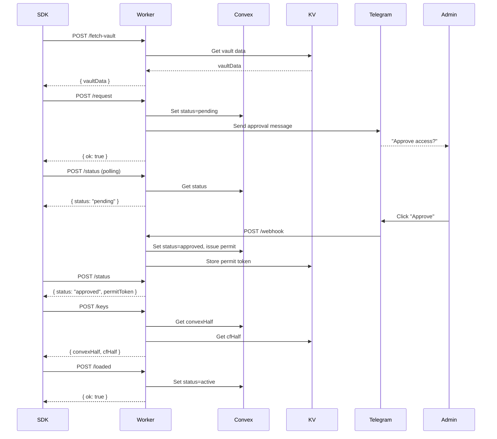
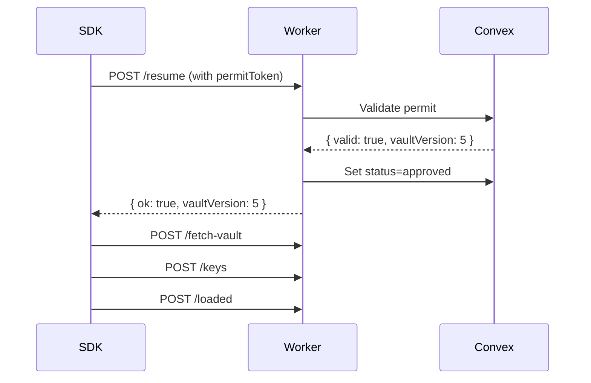

The Suron Worker exposes HTTP endpoints for SDK operations, CLI administration, and Telegram webhooks.

## Base URL

All requests are sent to your deployed Worker:

```
https://your-worker.workers.dev
```

---

## SDK Endpoints

These endpoints are called by the Suron SDK running on your server. All require `VAULT_ACCESS_TOKEN` authentication.

### POST /fetch-vault

Fetches encrypted vault data for an application.

<ParamField body="appId" type="string" required>
  Unique application identifier
</ParamField>

<ResponseField name="vaultData" type="string">
  Encrypted vault content in `.env` format
</ResponseField>

**Request Example**:
```json
{
  "appId": "my-api-production"
}
```

**Response Example**:
```json
{
  "vaultData": "DATABASE_URL=ENC[AES256_GCM,data:abc...,iv:def...,tag:ghi...,type:str]\nAPI_KEY=plaintext"
}
```

**Error Responses**:
- `400`: Missing `appId`
- `404`: No vault found for this app (run `suron encrypt`)
- `401`: Invalid or missing `VAULT_ACCESS_TOKEN`

**Source**: worker/src/index.js:70

---

### POST /request

Requests vault access and triggers Telegram notification to admin.

<ParamField body="appId" type="string" required>
  Unique application identifier
</ParamField>

<ParamField body="hostname" type="string">
  Server hostname (e.g., from `os.hostname()`). Shown in Telegram notification.
</ParamField>

<ResponseField name="ok" type="boolean">
  Always `true` if request succeeds
</ResponseField>

**Request Example**:
```json
{
  "appId": "my-api-production",
  "hostname": "ip-172-31-45-123.ec2.internal"
}
```

**Response Example**:
```json
{
  "ok": true
}
```

**Side Effects**:
1. Sets app status to `pending`
2. Stores hostname in database
3. Logs `access_requested` activity
4. Sends Telegram message with Approve/Deny buttons

**Error Responses**:
- `400`: Missing `appId`
- `404`: App not registered (run `suron init`)
- `401`: Invalid authentication token

**Source**: worker/src/index.js:79

---

### POST /resume

Attempts trusted restart using a valid permit token, skipping Telegram approval.

<ParamField body="appId" type="string" required>
  Application identifier
</ParamField>

<ParamField body="permitToken" type="string" required>
  Permit token from previous approval (stored in RAM)
</ParamField>

<ParamField body="hostname" type="string">
  Server hostname
</ParamField>

<ParamField body="knownVaultVersion" type="number">
  Last known vault version number
</ParamField>

<ResponseField name="ok" type="boolean">
  `true` if permit is valid, `false` if invalid/expired
</ResponseField>

<ResponseField name="vaultVersion" type="number">
  Current vault version (only when `ok: true`)
</ResponseField>

<ResponseField name="reason" type="string">
  Reason for failure: `'expired'`, `'revoked'`, or `'invalid'` (only when `ok: false`)
</ResponseField>

<ResponseField name="fallback" type="string">
  Always `'full_approval'` when permit fails (only when `ok: false`)
</ResponseField>

**Request Example**:
```json
{
  "appId": "my-api-production",
  "permitToken": "a1b2c3d4e5f6...",
  "hostname": "ip-172-31-45-123.ec2.internal",
  "knownVaultVersion": 5
}
```

**Success Response**:
```json
{
  "ok": true,
  "vaultVersion": 5
}
```

**Failure Response**:
```json
{
  "ok": false,
  "reason": "expired",
  "fallback": "full_approval"
}
```

**Side Effects (on success)**:
1. Sets status to `approved`
2. Updates hostname
3. Logs `resumed_with_permit` activity
4. Sends silent Telegram notification

**Error Responses**:
- `400`: Missing required fields
- `401`: Invalid authentication token

**Source**: worker/src/index.js:96

---

### POST /status

Polls current approval status. Used by SDK during approval waiting period.

<ParamField body="appId" type="string" required>
  Application identifier
</ParamField>

<ResponseField name="status" type="string">
  Current approval status: `'pending'`, `'approved'`, `'denied'`, `'active'`, or `'idle'`
</ResponseField>

<ResponseField name="permitToken" type="string | null">
  Permit token (only included when `status === 'approved'`)
</ResponseField>

**Request Example**:
```json
{
  "appId": "my-api-production"
}
```

**Response (Approved)**:
```json
{
  "status": "approved",
  "permitToken": "a1b2c3d4e5f6..."
}
```

**Response (Pending)**:
```json
{
  "status": "pending",
  "permitToken": null
}
```

**Response (Denied)**:
```json
{
  "status": "denied",
  "permitToken": null
}
```

**Error Responses**:
- `400`: Missing `appId`
- `401`: Invalid authentication token

**Source**: worker/src/index.js:118

---

### POST /keys

Fetches both halves of the master encryption key. Only works when status is `approved`.

<ParamField body="appId" type="string" required>
  Application identifier
</ParamField>

<ResponseField name="convexHalf" type="string">
  First half of master key (32 hex characters)
</ResponseField>

<ResponseField name="cfHalf" type="string">
  Second half of master key (32 hex characters)
</ResponseField>

**Request Example**:
```json
{
  "appId": "my-api-production"
}
```

**Response Example**:
```json
{
  "convexHalf": "0123456789abcdef0123456789abcdef",
  "cfHalf": "fedcba9876543210fedcba9876543210"
}
```

**Error Responses**:
- `400`: Missing `appId`
- `403`: App not approved yet (status must be `'approved'`)
- `500`: Key halves missing (run `suron init`)
- `401`: Invalid authentication token

**Source**: worker/src/index.js:132

---

### POST /loaded

Notifies Worker that secrets have been successfully loaded into memory. Transitions status from `approved` to `active`.

<ParamField body="appId" type="string" required>
  Application identifier
</ParamField>

<ResponseField name="ok" type="boolean">
  Always `true` if successful
</ResponseField>

**Request Example**:
```json
{
  "appId": "my-api-production"
}
```

**Response Example**:
```json
{
  "ok": true
}
```

**Side Effects**:
1. Sets status to `active`
2. Updates `lastActive` timestamp
3. Logs `secrets_loaded` activity

**Error Responses**:
- `400`: Missing `appId`
- `401`: Invalid authentication token

**Source**: worker/src/index.js:148

---

### POST /heartbeat

Sends periodic heartbeat and checks for vault updates or access revocation.

<ParamField body="appId" type="string" required>
  Application identifier
</ParamField>

<ParamField body="knownVaultVersion" type="number" required>
  Vault version currently loaded by SDK
</ParamField>

<ResponseField name="ok" type="boolean">
  Always `true`
</ResponseField>

<ResponseField name="status" type="string">
  Current approval status
</ResponseField>

<ResponseField name="vaultVersion" type="number">
  Latest vault version on server
</ResponseField>

<ResponseField name="shouldReload" type="boolean">
  `true` if `vaultVersion > knownVaultVersion` (triggers hot-reload)
</ResponseField>

**Request Example**:
```json
{
  "appId": "my-api-production",
  "knownVaultVersion": 5
}
```

**Response (No Update)**:
```json
{
  "ok": true,
  "status": "active",
  "vaultVersion": 5,
  "shouldReload": false
}
```

**Response (Vault Updated)**:
```json
{
  "ok": true,
  "status": "active",
  "vaultVersion": 6,
  "shouldReload": true
}
```

**Response (Access Revoked)**:
```json
{
  "ok": true,
  "status": "denied",
  "vaultVersion": 5,
  "shouldReload": false
}
```

**Side Effects**:
- Updates `lastHeartbeat` timestamp

**SDK Behavior**:
- If `status === 'denied'`: Emit `revoked` event and exit
- If `shouldReload === true`: Trigger hot-reload of secrets

**Error Responses**:
- `400`: Missing required fields
- `401`: Invalid authentication token

**Source**: worker/src/index.js:160

---

## CLI Admin Endpoints

These endpoints are used by the Suron CLI for administrative operations. Most require `VAULT_CLI_TOKEN` authentication (obtained via `/admin/login`).

### POST /admin/login

Authenticates CLI user and returns session token.

<Info>
This is the only admin endpoint that does NOT require token authentication.
</Info>

<ParamField body="username" type="string" required>
  Admin username (must match `ADMIN_USERNAME` in Worker secrets)
</ParamField>

<ParamField body="password" type="string" required>
  Admin password (must match `ADMIN_PASSWORD` in Worker secrets)
</ParamField>

<ResponseField name="token" type="string">
  CLI session token (equals `VAULT_CLI_TOKEN`)
</ResponseField>

**Request Example**:
```json
{
  "username": "admin",
  "password": "secure-password-123"
}
```

**Response Example**:
```json
{
  "token": "cli-token-abc123..."
}
```

**Error Responses**:
- `400`: Missing username or password
- `401`: Invalid credentials
- `500`: Worker secrets not configured

**Source**: worker/src/index.js:54

---

### POST /admin/init

Initializes a new application and stores split key halves.

<ParamField body="appId" type="string" required>
  Unique application identifier
</ParamField>

<ParamField body="convexHalf" type="string" required>
  First half of master key (32 hex characters)
</ParamField>

<ParamField body="cfHalf" type="string" required>
  Second half of master key (32 hex characters)
</ParamField>

<ResponseField name="ok" type="boolean">
  Always `true` if successful
</ResponseField>

**Request Example**:
```json
{
  "appId": "my-api-production",
  "convexHalf": "0123456789abcdef0123456789abcdef",
  "cfHalf": "fedcba9876543210fedcba9876543210"
}
```

**Response Example**:
```json
{
  "ok": true
}
```

**Side Effects**:
1. Creates app record in Convex
2. Stores `convexHalf` in Convex
3. Stores `cfHalf` in Cloudflare KV
4. Logs `initialized` activity

**Error Responses**:
- `400`: Missing required fields
- `401`: Invalid or missing CLI token

**Source**: worker/src/index.js:177

---

### POST /admin/keys

Retrieves both key halves for an application. Used by CLI for re-encryption during key rotation.

<ParamField body="appId" type="string" required>
  Application identifier
</ParamField>

<ResponseField name="convexHalf" type="string">
  First half of master key
</ResponseField>

<ResponseField name="cfHalf" type="string">
  Second half of master key
</ResponseField>

**Request Example**:
```json
{
  "appId": "my-api-production"
}
```

**Response Example**:
```json
{
  "convexHalf": "0123456789abcdef0123456789abcdef",
  "cfHalf": "fedcba9876543210fedcba9876543210"
}
```

**Error Responses**:
- `400`: Missing `appId`
- `404`: Keys not found (run `suron init`)
- `401`: Invalid or missing CLI token

**Source**: worker/src/index.js:190

---

### POST /admin/rotate

Rotates master encryption key by storing new key halves. Invalidates all active permits.

<ParamField body="appId" type="string" required>
  Application identifier
</ParamField>

<ParamField body="convexHalf" type="string" required>
  New first half of master key
</ParamField>

<ParamField body="cfHalf" type="string" required>
  New second half of master key
</ParamField>

<ResponseField name="ok" type="boolean">
  Always `true` if successful
</ResponseField>

**Request Example**:
```json
{
  "appId": "my-api-production",
  "convexHalf": "new0123456789abcdef0123456789ab",
  "cfHalf": "newfedcba9876543210fedcba987654"
}
```

**Response Example**:
```json
{
  "ok": true
}
```

**Side Effects**:
1. Replaces `convexHalf` in Convex
2. Replaces `cfHalf` in Cloudflare KV
3. Revokes all permits for this app
4. Logs `key_rotated` activity

<Warning>
After rotation, running servers must get fresh approval on next restart. Trusted restarts will fail until re-approved.
</Warning>

**Error Responses**:
- `400`: Missing required fields
- `401`: Invalid or missing CLI token

**Source**: worker/src/index.js:202

---

### POST /admin/upload

Uploads encrypted vault data and increments version number.

<ParamField body="appId" type="string" required>
  Application identifier
</ParamField>

<ParamField body="vaultData" type="string" required>
  Encrypted vault content in `.env` format
</ParamField>

<ResponseField name="ok" type="boolean">
  Always `true` if successful
</ResponseField>

**Request Example**:
```json
{
  "appId": "my-api-production",
  "vaultData": "DATABASE_URL=ENC[AES256_GCM,data:...,iv:...,tag:...,type:str]\n..."
}
```

**Response Example**:
```json
{
  "ok": true
}
```

**Side Effects**:
1. Stores `vaultData` in Cloudflare KV
2. Increments `vaultVersion` in Convex
3. Logs `vault_uploaded` activity
4. Next heartbeat will signal running apps to hot-reload

**Error Responses**:
- `400`: Missing required fields
- `401`: Invalid or missing CLI token

**Source**: worker/src/index.js:216

---

## Telegram Webhook

### POST /webhook

Receives Telegram updates (messages and button callbacks).

<Info>
This endpoint is called by Telegram's servers, not by your application. Authentication is handled via webhook secret verification.
</Info>

**Handles**:
- Inline button clicks (Approve, Deny, Stop, etc.)
- Text commands (`/apps`, `/app`, `/logs`, `/stop`)
- Admin verification

**Source**: worker/src/index.js:11, worker/src/telegram.js:135

---

## Authentication

See [Authentication](/api/worker/authentication) for detailed information on token types and authentication flows.

---

## Error Handling

All endpoints return errors in this format:

```json
{
  "error": "Error message describing what went wrong"
}
```

### Common HTTP Status Codes

| Code | Meaning | Common Causes |
|------|---------|---------------|
| `400` | Bad Request | Missing required fields, invalid JSON |
| `401` | Unauthorized | Invalid or missing authentication token |
| `403` | Forbidden | App not approved, access denied |
| `404` | Not Found | App not registered, vault not found |
| `405` | Method Not Allowed | Non-POST request to API endpoint |
| `500` | Internal Server Error | Database errors, missing configuration |

---

## Rate Limiting

<Info>
Cloudflare Workers have no explicit rate limits for your own requests. However, be mindful of:
- Convex query/mutation rate limits on your plan
- Cloudflare KV read/write limits (1000 ops/sec free, 10000 ops/sec paid)
</Info>

**SDK Request Pattern**:
- Initial load: 4-5 requests
- Heartbeat: 1 request every 30 seconds
- Hot-reload: 3 requests when vault updates

---

## Complete Request Flow

### First-Time Access



### Trusted Restart


