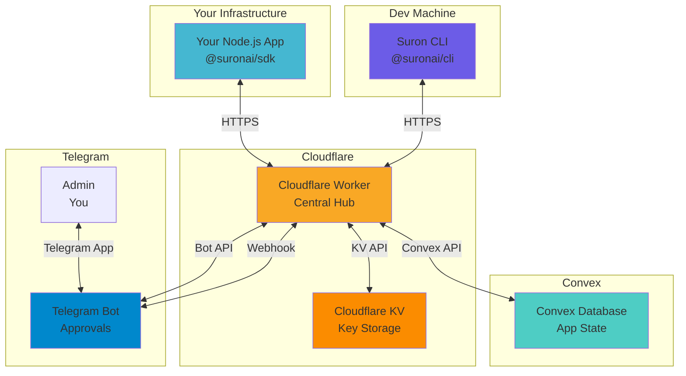
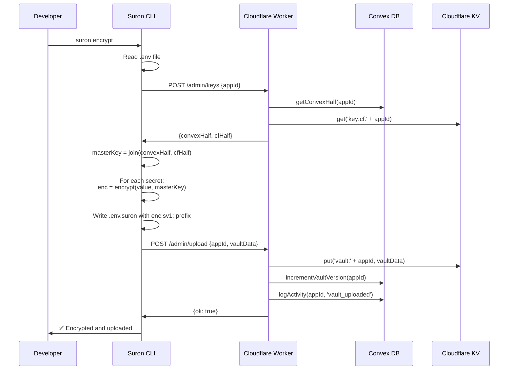
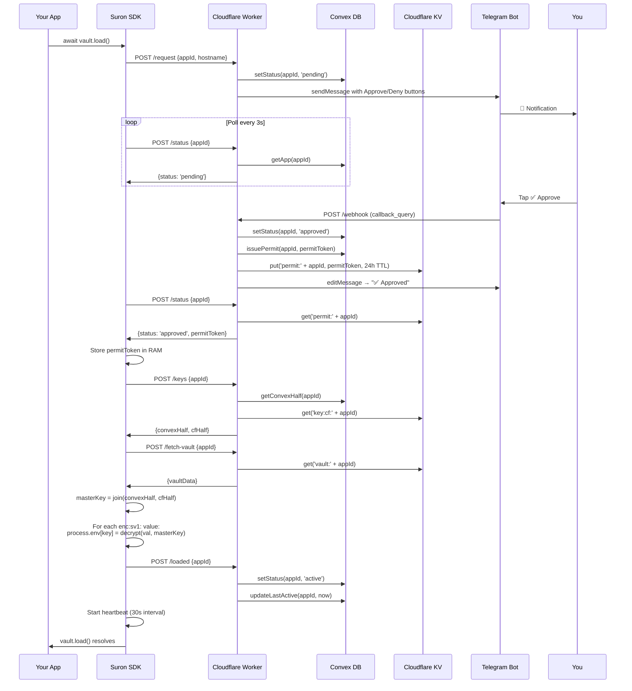
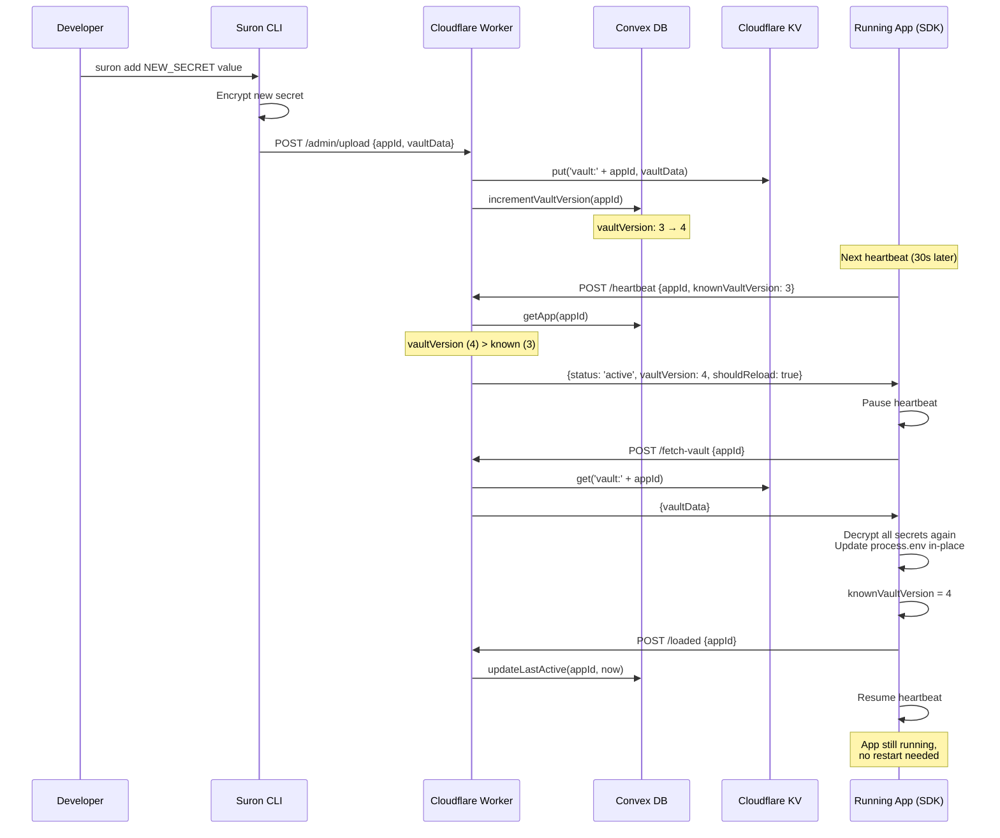

## System Overview

Suron Vault is a distributed secrets management system built on four core infrastructure components:



## Component Details

### 1. Cloudflare Worker (Central Hub)

**Role:** API gateway, authentication, orchestration

**Technology:** Cloudflare Workers (V8 isolate, edge computing)

**Code Location:** `/worker/src/index.js`

**Responsibilities:**
- Route SDK and CLI requests
- Authenticate tokens (`VAULT_ACCESS_TOKEN`, `VAULT_CLI_TOKEN`)
- Orchestrate Convex and KV operations
- Handle Telegram webhook callbacks
- Send Telegram notifications

**API Routes:**

```javascript worker/src/index.js
// SDK routes (VAULT_ACCESS_TOKEN)
POST /fetch-vault   {appId}                    → {vaultData}
POST /request       {appId, hostname}          → {ok}
POST /resume        {appId, permitToken, ...}  → {ok, vaultVersion}
POST /status        {appId}                    → {status, permitToken?}
POST /keys          {appId}                    → {convexHalf, cfHalf}
POST /loaded        {appId}                    → {ok}
POST /heartbeat     {appId, knownVaultVersion} → {status, shouldReload}

// CLI admin routes (VAULT_CLI_TOKEN)
POST /admin/login   {username, password}       → {token}
POST /admin/init    {appId, convexHalf, cfHalf} → {ok}
POST /admin/keys    {appId}                    → {convexHalf, cfHalf}
POST /admin/rotate  {appId, convexHalf, cfHalf} → {ok}
POST /admin/upload  {appId, vaultData}         → {ok}

// Telegram webhook
POST /webhook       (from Telegram)            → {ok}
```

**Secrets (via `wrangler secret put`):**
```bash
BOT_TOKEN            # Telegram bot token from @BotFather
VAULT_ACCESS_TOKEN   # SDK server token (openssl rand -hex 32)
VAULT_CLI_TOKEN      # CLI session token (openssl rand -hex 32)
ADMIN_USERNAME       # CLI login username
ADMIN_PASSWORD       # CLI login password
CONVEX_URL           # Convex deployment URL
CONVEX_DEPLOY_KEY    # Convex deploy key
```

**Environment Variables (wrangler.toml):**
```toml
[vars]
ADMIN_CHAT_ID = "123456789"  # Your Telegram user ID
```

**Deployment:**
```bash
cd worker
npm install
npx wrangler deploy
```

### 2. Convex Database

**Role:** Application state, metadata, audit logs, Convex key half

**Technology:** Convex (serverless database with real-time sync)

**Code Location:** `/convex/schema.js`, `/convex/vault.js`

**Schema:**

```javascript convex/schema.js
vault_apps: {
  appId: string,           // Unique app identifier
  status: string,          // 'idle' | 'pending' | 'approved' | 'active' | 'denied'
  convexHalf: string,      // First half of master key (32 hex chars)
  lastActive: number,      // Unix timestamp of last secret load
  lastHeartbeat: number,   // Unix timestamp of last heartbeat
  hostname: string,        // Real server hostname (from os.hostname())
  createdAt: number,       // Unix timestamp of app creation
  permitToken: string,     // 24h trusted restart token
  permitExpiry: number,    // Unix timestamp when permit expires
  vaultVersion: number,    // Incremented on each vault upload
}

vault_logs: {
  appId: string,           // App that triggered the event
  action: string,          // Event type (see below)
  timestamp: number,       // Unix timestamp
}
```

**Indexed Fields:**
- `vault_apps.appId` (for fast lookups)
- `vault_logs.appId` (for activity queries)

**Actions Logged:**
- `initialized` - App created via `suron init`
- `access_requested` - SDK called `/request`
- `approved` - Admin tapped ✅ Approve
- `denied` - Admin tapped ❌ Deny
- `stopped` - Admin tapped ⏹ Stop
- `secrets_loaded` - SDK completed decryption
- `key_rotated` - Admin ran `suron rotate`
- `vault_uploaded` - Admin ran `suron encrypt` or `suron add`
- `resumed_with_permit` - SDK used permit for trusted restart

**Mutations:**
```javascript convex/vault.js
createApp(appId, createdAt)
setStatus(appId, status)
updateLastActive(appId, lastActive)
updateHeartbeat(appId, lastHeartbeat)
storeConvexHalf(appId, convexHalf)
setHostname(appId, hostname)
issuePermit(appId, permitToken)         // Sets permitExpiry = now + 24h
revokePermit(appId)                     // Nulls permitToken and permitExpiry
incrementVaultVersion(appId)            // vaultVersion++
logActivity(appId, action, timestamp)
```

**Queries:**
```javascript convex/vault.js
getApp(appId) → app object
listApps() → array of all apps
getConvexHalf(appId) → convexHalf string
validatePermit(appId, permitToken) → {valid: bool, reason?: string, vaultVersion?: number}
getRecentLogs(appId) → last 10 log entries
```

**Deployment:**
```bash
npx convex deploy
```

### 3. Cloudflare KV

**Role:** Cloudflare key half, encrypted vault files, permit tokens

**Technology:** Cloudflare Workers KV (globally distributed key-value store)

**Key Naming Convention:**

```javascript
// Cloudflare half of master key
key:cf:{appId}   → "abc123def456..." (32 hex chars)

// Encrypted vault file
vault:{appId}    → "# Encrypted with @suronai/cli\nVAULT_APP=my-app\nDATABASE_URL=enc:sv1:..."

// Permit token for /status polling
permit:{appId}   → "f4e3d2c1b0a9..." (64 hex chars, 24h TTL)
```

**Access Patterns:**

```javascript worker/src/index.js
// Read operations
const cfHalf = await env.KV.get(`key:cf:${appId}`)
const vaultData = await env.KV.get(`vault:${appId}`)
const permitToken = await env.KV.get(`permit:${appId}`)

// Write operations
await env.KV.put(`key:cf:${appId}`, cfHalf)
await env.KV.put(`vault:${appId}`, vaultData)
await env.KV.put(`permit:${appId}`, permitToken, { expirationTtl: 86400 })  // 24h
```

**TTL (Time To Live):**
- `key:cf:{appId}` - No expiration (permanent)
- `vault:{appId}` - No expiration (permanent)
- `permit:{appId}` - 24 hours (auto-deleted)

**Setup:**
```bash
npx wrangler kv:namespace create KV
# Copy namespace ID to wrangler.toml:
# [[kv_namespaces]]
# binding = "KV"
# id = "abc123..."
```

### 4. Telegram Bot

**Role:** Admin approvals, access control, monitoring

**Technology:** Telegram Bot API (webhook-based)

**Bot Commands:**

```bash
/start        # Welcome message + View All Apps button
/apps         # List all apps with status indicators
/app <id>     # App detail with approve/deny/stop buttons
/logs <id>    # Last 10 activity log entries
/stop <id>    # Immediately revoke access (app exits on next heartbeat)
```

**Inline Buttons:**

```javascript worker/src/telegram.js
// Access request notification
{
  inline_keyboard: [[
    { text: '✅ Approve', callback_data: `approve:${appId}` },
    { text: '❌ Deny',   callback_data: `deny:${appId}` }
  ]]
}

// Active app detail
{
  inline_keyboard: [
    [{ text: '⏹ Stop App', callback_data: `stop:${appId}` }],
    [
      { text: 'Logs',       callback_data: `logs:${appId}` },
      { text: '← All Apps', callback_data: 'cmd:apps' }
    ]
  ]
}
```

**Status Indicators:**
- `● Active` - App is running, heartbeat recent
- `◐ Pending` - Waiting for admin approval
- `○ Idle` - App not running
- `○ Denied` - Access denied by admin

**Webhook Setup:**

```javascript worker/scripts/set-webhook.js
const res = await fetch(
  `https://api.telegram.org/bot${process.env.BOT_TOKEN}/setWebhook`,
  {
    method: 'POST',
    headers: { 'Content-Type': 'application/json' },
    body: JSON.stringify({
      url: `${process.env.VAULT_WORKER_URL}/webhook`
    })
  }
)
```

```bash
BOT_TOKEN=xxx VAULT_WORKER_URL=https://... node worker/scripts/set-webhook.js
```

**Security:**
- Only `ADMIN_CHAT_ID` can interact with the bot
- All other users receive "Unauthorized" response
- Bot token stored as Worker secret (never in code)

## Data Flow Diagrams

### Encrypt Flow (CLI)



### Decrypt Flow (SDK)



### Hot-Reload Flow



## Redundancy and Availability

### High Availability

| Component | Availability | Failover |
|-----------|--------------|----------|
| Cloudflare Worker | 99.99%+ (global edge network) | Automatic (closest edge location) |
| Cloudflare KV | 99.9%+ (multi-region) | Automatic (eventual consistency) |
| Convex | 99.9%+ (AWS infrastructure) | Automatic (managed service) |
| Telegram Bot API | 99.9%+ (Telegram SLA) | Automatic (Telegram infrastructure) |

### Data Durability

| Component | Durability | Backup Strategy |
|-----------|------------|----------------|
| Cloudflare KV | 99.999999999% (11 nines) | Cloudflare internal replication |
| Convex | 99.999999999% (11 nines) | Convex managed backups |
| `.env.suron` file | Git-based (your repo) | Git history + backups |

### Single Points of Failure

1. **Cloudflare Workers outage** - All SDK and CLI requests fail
   - Mitigation: Running apps continue working (secrets already in RAM), but cannot hot-reload or receive heartbeat responses

2. **Convex outage** - Cannot fetch Convex key half
   - Mitigation: None - Convex half is required for decryption

3. **Cloudflare KV outage** - Cannot fetch Cloudflare key half or vault files
   - Mitigation: None - KV data is required for decryption

4. **Telegram outage** - Cannot approve new deployments
   - Mitigation: Existing running apps continue working; new deployments must wait

<Warning>
  Suron Vault has no offline mode. If any component is unavailable, new deployments cannot decrypt secrets. Always have an emergency access plan (e.g., manual secret injection) for critical outages.
</Warning>

## Performance Characteristics

### Latency

| Operation | Typical Latency | Notes |
|-----------|----------------|-------|
| `POST /fetch-vault` | 50-150ms | KV read (global) |
| `POST /keys` | 100-300ms | Convex query + KV read |
| `POST /heartbeat` | 50-200ms | Convex mutation |
| `vault.load()` (approved) | 500-1000ms | Multiple round trips |
| `vault.load()` (waiting) | 2-30s | Depends on admin response |
| Hot-reload | 500-1000ms | Same as approved load |

### Throughput

- **Cloudflare Workers** - 1000+ req/s (subrequest limits apply)
- **Cloudflare KV** - 1000+ reads/s per key, 1 write/s per key
- **Convex** - 100+ mutations/s (depends on plan)

<Info>
  Heartbeat polling is minimal (1 request per app per 30s). Even with 100 running apps, that's only ~3 req/s to the Worker.
</Info>

### Resource Usage

| Resource | Usage | Limits |
|----------|-------|--------|
| Cloudflare Worker CPU | Less than 1ms per request | 50ms limit (free), 50s limit (paid) |
| Cloudflare KV storage | ~1KB per app (keys + permit) + vault size | 1GB (free), unlimited (paid) |
| Convex storage | ~500 bytes per app + logs | 1GB (free), 8GB+ (paid) |
| Telegram Bot API | ~10 requests per approval | 30 req/s (per bot) |

## Scalability

### Horizontal Scaling

- **Apps** - No limit (each app is independent)
- **Secrets per app** - Limited by vault file size (recommend less than 100KB)
- **Deployments** - No limit (stateless)
- **Admins** - 1 (single `ADMIN_CHAT_ID`)

<Note>
  Suron Vault is designed for small-to-medium teams (1-100 apps). For enterprise scale (1000+ apps, multiple admins, complex RBAC), consider a dedicated secrets manager like HashiCorp Vault or AWS Secrets Manager.
</Note>

### Vertical Scaling

- Cloudflare Workers scale automatically (no configuration)
- Convex scales automatically (upgrade plan for more storage/throughput)
- Cloudflare KV scales automatically (upgrade plan for more storage)

## Cost Estimate

Example for 10 apps with 5 deployments/day:

| Service | Free Tier | Paid Plan | Estimated Cost |
|---------|-----------|-----------|----------------|
| Cloudflare Workers | 100k req/day | $5/mo + $0.50 per million req | $0 (well within free tier) |
| Cloudflare KV | 1GB, 100k reads/day | $5/mo + usage | $0 (within free tier) |
| Convex | 1GB, 1M rows | $25/mo (Pro) | $0-25/mo |
| Telegram Bot | Free | N/A | $0 |
| **Total** | | | **$0-25/mo** |

<Info>
  Suron Vault can run entirely on free tiers for small teams. The only cost is Convex if you exceed 1GB storage or need advanced features.
</Info>

## Next Steps

<CardGroup cols={2}>
  <Card title="Vault File Format" icon="file-code" href="/concepts/vault-file-format">
    Learn about the .env.suron encryption format
  </Card>
  <Card title="Deploy Your Own" icon="rocket" href="/deployment">
    Set up your own Suron Vault infrastructure
  </Card>
  <Card title="Security Model" icon="shield-halved" href="/concepts/security-model">
    Deep dive into split-key architecture
  </Card>
  <Card title="How It Works" icon="diagram-project" href="/concepts/how-it-works">
    Complete flow from encrypt to decrypt
  </Card>
</CardGroup>