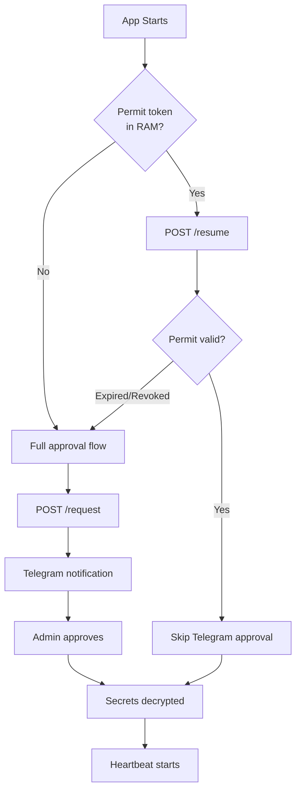

## Overview

Suron Vault uses a split-key architecture with Telegram approval to decrypt secrets at runtime. The system ensures that secrets are never stored unencrypted and that every deployment requires explicit admin authorization.

## Complete Flow

<Steps>
  <Step title="Encrypt Secrets">
    When you run `suron encrypt`, the CLI:
    
    1. Reads your `.env` file
    2. Fetches both halves of the master key from the Worker
    3. Encrypts each secret value individually using AES-256-GCM
    4. Writes encrypted values to `.env.suron` with the `enc:sv1:` prefix
    5. Automatically uploads the vault file to Cloudflare KV
    
    ```bash
    suron encrypt
    ```
    
    The resulting `.env.suron` file is safe to commit:
    
    ```bash .env.suron
    # Encrypted with @suronai/cli
    VAULT_APP=my-app
    DATABASE_URL=enc:sv1:aGVsbG8gd29ybGQ...
    API_KEY=enc:sv1:c2VjcmV0a2V5...
    ```
  </Step>

  <Step title="Deploy Application">
    Deploy your application with three environment variables:
    
    ```bash
    VAULT_WORKER_URL=https://suronai-vault.your-account.workers.dev
    VAULT_ACCESS_TOKEN=your_server_access_token
    VAULT_APP_ID=my-app
    ```
    
    <Note>
      The server token (`VAULT_ACCESS_TOKEN`) can only access SDK routes. It cannot reach admin routes like `/admin/rotate` or `/admin/upload`.
    </Note>
  </Step>

  <Step title="Application Startup">
    When your application starts and calls `vault.load()`:
    
    ```javascript
    import { vault } from '@suronai/sdk'
    
    await vault.load()  // Blocks until approved
    ```
    
    The SDK performs the following sequence:
    
    ```mermaid
    sequenceDiagram
        participant App as Your App
        participant SDK as Suron SDK
        participant Worker as Cloudflare Worker
        participant Convex as Convex DB
        participant KV as Cloudflare KV
        participant Telegram as Telegram Bot
        participant Admin as You (Admin)
        
        App->>SDK: vault.load()
        SDK->>SDK: Read VAULT_APP_ID from env
        SDK->>SDK: Check for permit token in RAM
        
        alt No permit or permit expired
            SDK->>Worker: POST /request {appId, hostname}
            Worker->>Convex: setStatus('pending')
            Worker->>Telegram: Send approval request
            Telegram->>Admin: 🔔 Notification with Approve/Deny buttons
            SDK->>Worker: Poll /status every 3s
            Admin->>Telegram: Tap ✅ Approve
            Telegram->>Worker: Webhook callback
            Worker->>Convex: setStatus('approved')
            Worker->>Convex: issuePermit(permitToken)
            Worker->>KV: Store permit token (24h TTL)
            SDK->>Worker: /status (polling)
            Worker->>SDK: {status: 'approved', permitToken}
            SDK->>SDK: Store permitToken in RAM
        else Permit exists and valid
            SDK->>Worker: POST /resume {appId, permitToken}
            Worker->>Convex: validatePermit()
            Worker->>SDK: {ok: true, vaultVersion}
            Worker->>Telegram: Silent notification (auto-resumed)
        end
        
        SDK->>Worker: POST /keys {appId}
        Worker->>Convex: getConvexHalf(appId)
        Worker->>KV: get('key:cf:' + appId)
        Worker->>SDK: {convexHalf, cfHalf}
        SDK->>SDK: masterKey = convexHalf + cfHalf
        SDK->>Worker: POST /fetch-vault {appId}
        Worker->>KV: get('vault:' + appId)
        Worker->>SDK: {vaultData}
        SDK->>SDK: Decrypt all enc:sv1: values
        SDK->>SDK: Inject into process.env (RAM only)
        SDK->>Worker: POST /loaded {appId}
        Worker->>Convex: setStatus('active')
        SDK->>SDK: Start heartbeat (30s interval)
        SDK->>App: vault.load() resolves
        App->>App: Use process.env.DATABASE_URL, etc.
    ```
  </Step>

  <Step title="Heartbeat Mechanism">
    After successful load, the SDK starts a 30-second heartbeat:
    
    ```javascript SDK/src/heartbeat.js
    const HEARTBEAT_MS = 30000
    
    setInterval(async () => {
      const { status, shouldReload, vaultVersion } = await post(
        workerUrl, '/heartbeat',
        { appId, knownVaultVersion },
        token
      )
      
      if (status === 'denied') {
        // Admin revoked access
        events.emit('revoked', appId)
        process.exit(1)
      }
      
      if (shouldReload) {
        // Vault was updated - reload secrets
        await hotReload(workerUrl, appId, token, vaultVersion)
      }
    }, HEARTBEAT_MS)
    ```
    
    The heartbeat serves three purposes:
    
    1. **Liveness check** - Worker knows the app is still running
    2. **Access control** - Admin can revoke access by setting status to 'denied'
    3. **Hot-reload trigger** - Detects when vault version has changed
  </Step>

  <Step title="Hot-Reload Behavior">
    When you update secrets using `suron add` or `suron encrypt`:
    
    1. CLI encrypts and uploads new vault file to Cloudflare KV
    2. Worker increments `vaultVersion` in Convex
    3. Next heartbeat detects `vaultVersion > knownVaultVersion`
    4. SDK calls `hotReload()` function:
    
    ```javascript SDK/src/vault.js
    export async function hotReload(workerUrl, appId, token, newVaultVersion) {
      log.info('Secrets updated — reloading in-place')
      
      const loaded = await fetchAndDecrypt(workerUrl, appId, token)
      _knownVaultVersion = newVaultVersion
      
      await post(workerUrl, '/loaded', { appId }, token)
      log.success(`${loaded} secrets hot-reloaded`)
    }
    ```
    
    <Warning>
      Hot-reload only updates `process.env` in-place. Values already destructured at module load time are **not** updated:
      
      ```javascript
      // ❌ This won't update on hot-reload
      const API_KEY = process.env.API_KEY
      
      // ✅ This will always be current
      function getApiKey() {
        return process.env.API_KEY
      }
      ```
    </Warning>
    
    The hot-reload is seamless:
    - No process restart required
    - No Telegram approval needed (uses existing permit)
    - Completes in < 1 second
    - Application stays online throughout
  </Step>
</Steps>

## Trusted Restart Flow

When your app restarts (e.g., after a deployment), the SDK can skip Telegram approval if it has a valid permit token:



### Persisting Permits Across Restarts

By default, permit tokens are stored in RAM only and don't survive process restarts. To enable true zero-downtime restarts:

```javascript
import { vault } from '@suronai/sdk'
import { writeFileSync } from 'fs'

// First load - requires Telegram approval
await vault.load()

// Save permit token to disk (outside git!)
const permit = vault.getPermitToken()
writeFileSync('.vault-permit', permit)

// On next restart, before vault.load():
process.env.VAULT_PERMIT = readFileSync('.vault-permit', 'utf8')
await vault.load()  // No Telegram approval needed
```

<Warning>
  Never commit `.vault-permit` to git. Add it to `.gitignore` immediately. A permit token grants 24-hour vault access.
</Warning>

## Access Control

Admins can control running applications via Telegram:

- **Approve** - Allow secrets to decrypt (generates 24h permit)
- **Deny** - Reject access (app crashes after 5min timeout)
- **Stop** - Revoke access to running app (app exits within 30s on next heartbeat)

The Worker tracks application state in Convex:

```javascript convex/schema.js
vault_apps: {
  appId: string,
  status: string,        // 'idle' | 'pending' | 'approved' | 'active' | 'denied'
  convexHalf: string,    // First half of master key
  permitToken: string,   // 24h trusted restart token
  permitExpiry: number,  // Unix timestamp
  vaultVersion: number,  // Incremented on each upload
  lastActive: number,    // Last time app loaded secrets
  lastHeartbeat: number, // Last heartbeat received
  hostname: string,      // Real server hostname (from os.hostname())
  createdAt: number
}
```

## Error Handling

### Approval Timeout

If no response after 5 minutes, the SDK throws an error:

```javascript SDK/src/poller.js
const TIMEOUT_MS = 5 * 60 * 1000

if (Date.now() > deadline) {
  throw new Error('No response after 5 minutes — access denied by timeout')
}
```

### Approval Denied

If admin taps "Deny":

```javascript
if (status === 'denied') {
  throw new Error('Access denied by admin')
}
```

### Heartbeat Revocation

If admin stops the app while it's running:

```javascript SDK/src/heartbeat.js
if (status === 'denied') {
  clearInterval(iv)
  log.error('Access revoked by admin — shutting down')
  events.emit('revoked', appId)
  setImmediate(() => process.exit(1))
}
```

Applications can listen for revocation events:

```javascript
import { vault, events } from '@suronai/sdk'

events.on('revoked', async (appId) => {
  console.log(`Access revoked for ${appId}`)
  await db.close()
  await redis.quit()
})

await vault.load()
```

## Performance Characteristics

- **First load** (with approval): 2-30 seconds (depends on admin response time)
- **Trusted restart**: < 500ms (no Telegram approval)
- **Hot-reload**: < 1 second (no restart, no approval)
- **Heartbeat overhead**: ~50ms every 30 seconds
- **Polling overhead**: ~20ms every 3 seconds (only during approval wait)

## Next Steps

<CardGroup cols={2}>
  <Card title="Security Model" icon="shield-halved" href="/concepts/security-model">
    Deep dive into split-key architecture and threat model
  </Card>
  <Card title="Architecture" icon="sitemap" href="/concepts/architecture">
    Understand the infrastructure components
  </Card>
  <Card title="Vault File Format" icon="file-code" href="/concepts/vault-file-format">
    Learn about the .env.suron encryption format
  </Card>
  <Card title="SDK Reference" icon="code" href="/sdk/vault">
    Full API documentation for @suronai/sdk
  </Card>
</CardGroup>