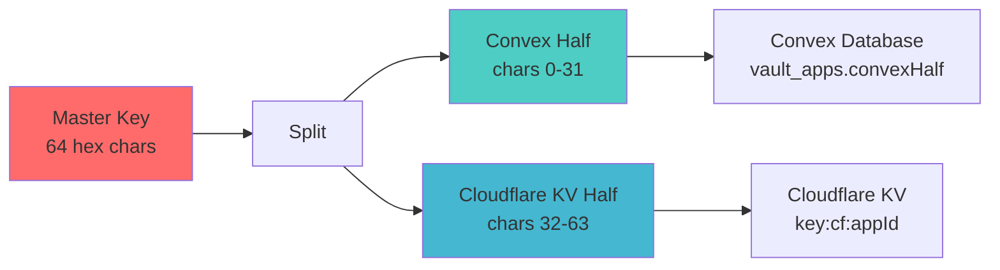

## Core Security Principles

Suron Vault is built on three foundational security principles:

1. **Split master key** - No single system can decrypt secrets alone
2. **RAM-only decryption** - Secrets never written to disk at runtime
3. **Explicit approval** - Every deployment requires admin authorization

## Split Master Key Architecture

### Key Generation

When you run `suron init`, a master key is generated and immediately split:

```javascript CLI/src/crypto.js
export function generateMasterKey() {
  return randomBytes(KEY_LEN).toString('hex')  // 32 bytes = 256 bits
}

export function splitKey(masterKey) {
  const mid = Math.ceil(masterKey.length / 2)
  return { 
    convexHalf: masterKey.substring(0, mid), 
    cfHalf: masterKey.substring(mid) 
  }
}
```

The master key is a 64-character hex string (256 bits). It's split evenly:

- **First 32 characters** → Stored in Convex database
- **Last 32 characters** → Stored in Cloudflare KV

<Warning>
  The complete master key **never exists** in either storage system. Only the CLI and SDK (at runtime, in RAM) ever reconstruct the full key.
</Warning>

### Key Storage



### Key Reconstruction

The master key is only reconstructed in two scenarios:

#### 1. CLI Operations (Encrypt/Decrypt)

```javascript CLI/src/commands/encrypt.js
// Fetch both halves from Worker
const { convexHalf, cfHalf } = await post(workerUrl, '/admin/keys', { appId }, token)

// Reconstruct in RAM
const masterKey = joinKey(convexHalf, cfHalf)

// Encrypt secrets
const encrypted = encrypt(plaintext, masterKey)
```

#### 2. SDK Runtime (Decrypt)

```javascript SDK/src/vault.js
// After Telegram approval, fetch both halves
const { convexHalf, cfHalf } = await post(workerUrl, '/keys', { appId }, token)

// Reconstruct in RAM
const masterKey = joinKey(convexHalf, cfHalf)

// Decrypt secrets into process.env
process.env[key] = decrypt(encryptedValue, masterKey)
```

<Info>
  The master key exists in RAM for only a few milliseconds during encryption/decryption operations. It's never logged, never written to disk, and immediately garbage collected.
</Info>

## Threat Model

### What Suron Vault Protects Against

<AccordionGroup>
  <Accordion title="✅ Cloudflare KV Compromise">
    If an attacker gains access to Cloudflare KV:
    
    - They can read the Cloudflare half of the master key
    - They can read encrypted vault files
    - **They cannot decrypt anything** - missing Convex half
    
    No secrets are exposed.
  </Accordion>

  <Accordion title="✅ Convex Database Compromise">
    If an attacker gains access to Convex:
    
    - They can read the Convex half of the master key
    - **They cannot decrypt anything** - missing Cloudflare half and vault files
    
    No secrets are exposed.
  </Accordion>

  <Accordion title="✅ Git Repository Leak">
    If your `.env.suron` file is leaked via git:
    
    - Attacker has encrypted secrets
    - **They cannot decrypt anything** - missing both key halves
    
    This is why `.env.suron` is safe to commit.
  </Accordion>

  <Accordion title="✅ Server Access Token Leak">
    If `VAULT_ACCESS_TOKEN` is exposed:
    
    - Attacker can call SDK routes (`/keys`, `/fetch-vault`)
    - **But only if they also compromise Telegram** to approve access
    - They **cannot** rotate keys or upload new vaults (requires CLI token)
    
    Access still requires Telegram approval.
  </Accordion>

  <Accordion title="✅ Unauthorized Deployment">
    If someone deploys a rogue instance of your app:
    
    - They send a `/request` to the Worker
    - **You see the Telegram notification** with hostname
    - You tap "Deny" or ignore it
    - Deployment fails after 5min timeout
    
    No secrets are exposed without your explicit approval.
  </Accordion>

  <Accordion title="✅ Running Server Memory Dump">
    If an attacker dumps memory from a running server:
    
    - They can read decrypted secrets from `process.env`
    - **Same as any server compromise** - not Suron-specific
    
    Suron Vault doesn't protect against active server compromise (no secrets manager can). The key benefit: secrets aren't stored on disk, so they're not in container images, backups, logs, or crash dumps.
  </Accordion>
</AccordionGroup>

### What Suron Vault Does NOT Protect Against

<AccordionGroup>
  <Accordion title="❌ Both Cloudflare AND Convex Compromised">
    If an attacker compromises **both** systems:
    
    - They have both key halves
    - They can decrypt all secrets
    
    This requires two independent breaches. Suron assumes Cloudflare and Convex are not colluding adversaries.
  </Accordion>

  <Accordion title="❌ Admin Telegram Account Compromised">
    If an attacker gains access to your Telegram account:
    
    - They can approve rogue deployments
    - They can stop legitimate apps
    
    Enable Telegram 2FA and use a strong password.
  </Accordion>

  <Accordion title="❌ CLI Machine Compromised">
    If an attacker gains access to your dev machine:
    
    - They can read `~/.suron/auth.json` (CLI session token)
    - They can rotate keys, upload new vaults, decrypt secrets
    
    Protect your dev machine with disk encryption and strong authentication.
  </Accordion>

  <Accordion title="❌ Supply Chain Attack">
    If an attacker compromises the `@suronai/sdk` or `@suronai/cli` packages:
    
    - They can exfiltrate secrets at runtime
    - They can steal session tokens
    
    Always verify package integrity and pin versions in production.
  </Accordion>
</AccordionGroup>

## Token Separation

Suron uses three distinct tokens with different privileges:

### 1. CLI Token (`VAULT_CLI_TOKEN`)

**Privilege level:** Admin

**Can access:**
- `/admin/init` - Create new apps and store key halves
- `/admin/keys` - Read both key halves
- `/admin/rotate` - Rotate master key
- `/admin/upload` - Upload new vault files

**Cannot access:**
- SDK routes (no `/keys`, `/fetch-vault`)

**Storage:**
- Lives in `~/.suron/auth.json` on your dev machine
- Never deployed to servers
- Obtained via `suron login` (username + password)

**Rotation:**
- Admin rotates `VAULT_CLI_TOKEN` Worker secret
- All CLI sessions invalidated
- Users must `suron login` again

### 2. Server Token (`VAULT_ACCESS_TOKEN`)

**Privilege level:** SDK runtime

**Can access:**
- `/fetch-vault` - Download encrypted vault file
- `/request` - Request Telegram approval
- `/resume` - Attempt trusted restart with permit
- `/status` - Poll approval status
- `/keys` - Fetch key halves (only after approval)
- `/loaded` - Mark app as active
- `/heartbeat` - Keep-alive and hot-reload detection

**Cannot access:**
- Admin routes (`/admin/*`)

**Storage:**
- Set as environment variable on production servers
- Never on dev machines
- Generated with `openssl rand -hex 32`

**Rotation:**
- Admin rotates `VAULT_ACCESS_TOKEN` Worker secret
- All running apps lose access
- Redeploy all apps with new token

### 3. Permit Token

**Privilege level:** Temporary, per-app runtime

**Can access:**
- `/resume` - Skip Telegram approval on restart

**Cannot access:**
- Any other routes (permit alone is useless)

**Storage:**
- SDK stores in RAM by default
- Optionally persisted to disk (see [example 06-trusted-restart](https://github.com/Cryptoistaken/Suron/tree/main/examples/06-trusted-restart))
- Also in Convex (with expiry) and Cloudflare KV (24h TTL)

**Lifetime:**
- Issued on approval (admin taps ✅ Approve)
- Valid for 24 hours
- Revoked on key rotation or admin Stop

**Format:**
```javascript worker/src/telegram.js
const permitToken = randomBytes(32).toString('hex')  // 64 hex chars
```

### Token Authorization Flow

```javascript worker/src/utils.js
export function requireToken(request, env) {
  const token = request.headers.get('x-vault-token')
  if (!token || token !== env.VAULT_ACCESS_TOKEN) {
    return err(401, 'Unauthorized')
  }
  return null  // OK
}

export function requireCliToken(request, env) {
  const token = request.headers.get('x-vault-token')
  if (!token || token !== env.VAULT_CLI_TOKEN) {
    return err(401, 'Unauthorized')
  }
  return null  // OK
}
```

```javascript worker/src/index.js
if (path === '/keys') return sdkRoute(request, env, body, handleKeys)
if (path === '/admin/upload') return cliRoute(request, env, body, handleAdminUpload)
```

<Info>
  Even if an attacker obtains `VAULT_ACCESS_TOKEN`, they cannot rotate keys or upload malicious vaults. Those operations require `VAULT_CLI_TOKEN`, which never leaves your dev machine.
</Info>

## Encryption Implementation

Suron uses AES-256-GCM with scrypt key derivation:

```javascript SDK/src/crypto.js
const ALGO       = 'aes-256-gcm'
const SALT_LEN   = 32   // 256 bits
const IV_LEN     = 16   // 128 bits
const TAG_LEN    = 16   // 128 bits
const KEY_LEN    = 32   // 256 bits
const ENC_PREFIX = 'enc:sv1:'

function deriveKey(masterKey, salt) {
  return scryptSync(masterKey, salt, KEY_LEN)
}

export function encrypt(plaintext, masterKey) {
  const salt   = randomBytes(SALT_LEN)  // Unique per value
  const iv     = randomBytes(IV_LEN)    // Unique per value
  const key    = deriveKey(masterKey, salt)
  const cipher = createCipheriv(ALGO, key, iv)
  const enc    = Buffer.concat([cipher.update(plaintext, 'utf8'), cipher.final()])
  const tag    = cipher.getAuthTag()    // Authenticated encryption
  const raw    = Buffer.concat([salt, iv, tag, enc]).toString('base64')
  return `${ENC_PREFIX}${raw}`
}
```

### Encryption Properties

| Property | Value | Notes |
|----------|-------|-------|
| Algorithm | AES-256-GCM | Authenticated encryption (prevents tampering) |
| Key derivation | scrypt | Memory-hard, resistant to brute force |
| Salt | 32 bytes (random) | Unique per encrypted value |
| IV | 16 bytes (random) | Unique per encrypted value |
| Auth tag | 16 bytes | Ensures ciphertext integrity |
| Key size | 256 bits | Industry standard for high security |

### Why Scrypt?

Scrypt is memory-hard, making brute-force attacks expensive even with specialized hardware (GPUs, ASICs):

```javascript
scryptSync(masterKey, salt, KEY_LEN)
// Default params: N=16384, r=8, p=1
// Memory cost: ~16 MB per hash
```

Compare to other KDFs:

- **PBKDF2** - CPU-bound, vulnerable to GPU attacks
- **bcrypt** - Better than PBKDF2, but less memory-hard than scrypt
- **Argon2** - Modern alternative, not yet in Node.js stdlib

Scrypt is a good balance of security and Node.js compatibility.

## RAM-Only Decryption

Secrets are decrypted directly into `process.env` and never written to disk:

```javascript SDK/src/vault.js
const secrets = parseVaultFile(vaultData)

for (const [key, val] of Object.entries(secrets)) {
  try {
    // Decrypt in RAM, store in process.env
    process.env[key] = isEncrypted(val) ? decrypt(val, masterKey) : val
  } catch {
    log.error(`Failed to decrypt: ${key}`)
  }
}
```

This means:

- Secrets are not in container images
- Secrets are not in filesystem snapshots
- Secrets are not in log files (unless your app logs them)
- Secrets are not in crash dumps (unless OS core dumps include heap)

<Warning>
  Always configure your application to **not log environment variables**. Many frameworks log `process.env` on startup by default.
</Warning>

## Permit Token Security

### Default: RAM Only

By default, permit tokens are stored in a module-scoped variable:

```javascript SDK/src/vault.js
let _permitToken = process.env.VAULT_PERMIT ?? null

if (_permitToken) {
  // Try trusted restart
  const resume = await post(workerUrl, '/resume', {
    appId,
    permitToken: _permitToken,
    hostname: host,
    knownVaultVersion: _knownVaultVersion,
  }, token)
  
  if (resume.ok) {
    // Permit accepted
    log.success('Trusted restart approved — reloading secrets')
  } else {
    // Permit rejected
    log.warning(`Permit ${resume.reason ?? 'invalid'} — requesting fresh approval`)
    _permitToken = null
  }
}
```

**Lifetime:**
- Survives hot-reloads (module scope persists)
- **Does not survive process restarts** (RAM cleared)

### Optional: Persist to Disk

For zero-downtime deployments, you can persist the permit:

```javascript
import { vault } from '@suronai/sdk'
import { writeFileSync, readFileSync } from 'fs'

// On first load
await vault.load()
const permit = vault.getPermitToken()
writeFileSync('.vault-permit', permit)

// On restart
process.env.VAULT_PERMIT = readFileSync('.vault-permit', 'utf8')
await vault.load()  // No Telegram approval needed
```

**Security considerations:**

1. **Add to .gitignore** - Never commit `.vault-permit`
2. **File permissions** - `chmod 600 .vault-permit` (owner read/write only)
3. **Rotation** - Permit expires after 24h, invalidated on key rotation
4. **Revocation** - Admin can revoke permit by tapping Stop

See [example 06-trusted-restart](https://github.com/Cryptoistaken/Suron/tree/main/examples/06-trusted-restart) for implementation.

## Security Best Practices

<CardGroup cols={2}>
  <Card title="Enable Telegram 2FA" icon="shield-check">
    Protect your admin Telegram account with two-factor authentication.
  </Card>
  
  <Card title="Rotate Tokens Regularly" icon="arrows-rotate">
    Rotate `VAULT_ACCESS_TOKEN` and `VAULT_CLI_TOKEN` every 90 days.
  </Card>
  
  <Card title="Audit Activity Logs" icon="list-check">
    Review Convex `vault_logs` for suspicious access patterns.
  </Card>
  
  <Card title="Pin Package Versions" icon="thumbtack">
    Lock `@suronai/sdk` and `@suronai/cli` versions in production.
  </Card>
  
  <Card title="Encrypt Dev Machine" icon="laptop">
    Use full-disk encryption on machines with `~/.suron/auth.json`.
  </Card>
  
  <Card title="Monitor Telegram Notifications" icon="bell">
    Always investigate unexpected approval requests.
  </Card>
</CardGroup>

## Compliance Considerations

### GDPR / Data Residency

- **Cloudflare KV** - Global, but you can configure region preferences
- **Convex** - US-based (AWS us-east-1)
- **Encrypted data** - GDPR considers encrypted data "pseudonymized", not "anonymous"

If you have strict data residency requirements, evaluate Cloudflare and Convex's compliance certifications.

### SOC 2 / ISO 27001

Suron Vault's architecture supports common compliance requirements:

- ✅ Secrets encrypted at rest (AES-256-GCM)
- ✅ Secrets encrypted in transit (TLS)
- ✅ Access control (Telegram approval + token separation)
- ✅ Audit logging (Convex `vault_logs`)
- ✅ Key rotation capability (`suron rotate`)

However, Suron Vault itself is not a compliance framework. You still need:

- Regular access reviews
- Incident response procedures
- Key management policies
- Vendor risk assessments (Cloudflare, Convex, Telegram)

## Next Steps

<CardGroup cols={2}>
  <Card title="Architecture" icon="sitemap" href="/concepts/architecture">
    Understand the infrastructure components
  </Card>
  <Card title="Vault File Format" icon="file-code" href="/concepts/vault-file-format">
    Learn about the .env.suron encryption format
  </Card>
  <Card title="Deploy Your Own" icon="rocket" href="/deployment">
    Set up your own Suron Vault infrastructure
  </Card>
  <Card title="CLI Reference" icon="terminal" href="/cli/commands">
    Full command reference
  </Card>
</CardGroup>