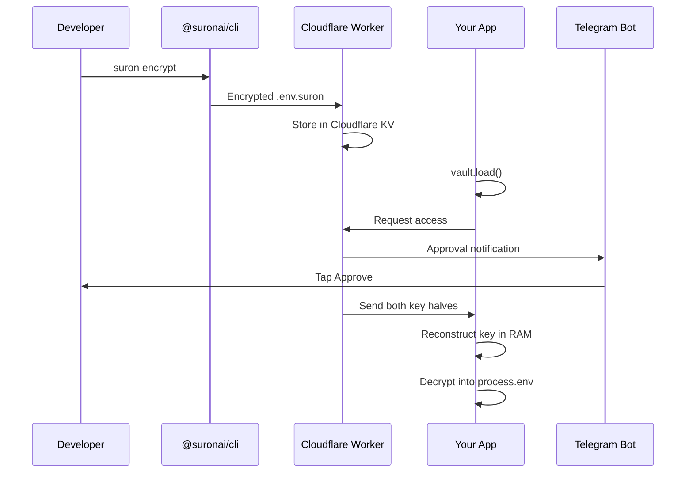

## What is Suron Vault?

Suron Vault is an encrypted secrets manager for Node.js applications that encrypts your secrets into a `.env.suron` file safe to commit to git. When your server starts, it requests approval via Telegram — you tap **Approve** and the secrets are decrypted directly into `process.env` in RAM. Nothing is ever written to disk at runtime.

```javascript
import { vault } from '@suronai/sdk'

await vault.load()   // blocks until you approve on Telegram

console.log(process.env.DATABASE_URL)   // decrypted, RAM only
```

## Why Suron Vault?

Traditional secret management approaches have significant drawbacks:

- **Plain `.env` files** are dangerous to commit and leak easily
- **Cloud secret managers** require network calls, vendor lock-in, and complex IAM
- **Environment variables on platforms** scatter secrets across deployment UIs
- **Encrypted env files** still need the master key stored somewhere

Suron Vault solves these problems with a **split-key security model** — the master key is split across two independent systems (Convex + Cloudflare KV). Neither half alone can decrypt anything. Even if one system is compromised, your secrets remain safe.

## Split-Key Security Model

The core innovation is the split master key:

```
masterKey = convexHalf + cfHalf
```

<Steps>
  <Step title="Key Generation">
    When you run `suron init`, a 256-bit master key is generated locally and immediately split into two halves.
  </Step>
  
  <Step title="Distributed Storage">
    One half is stored in Convex, the other in Cloudflare KV. The full key never exists on any server.
  </Step>
  
  <Step title="Runtime Reconstruction">
    When your app calls `vault.load()`, both halves are fetched and combined **in RAM only** to decrypt secrets.
  </Step>
  
  <Step title="Memory-Only">
    Secrets are decrypted into `process.env` and live only in RAM — never written to disk at runtime.
  </Step>
</Steps>

<Note>
The master key is never stored whole. Even if an attacker compromises Convex OR Cloudflare KV, they cannot decrypt your secrets without both halves.
</Note>

## Key Features

<CardGroup cols={2}>
  <Card title="AES-256-GCM Encryption" icon="lock">
    Per-value encryption with unique salt and initialization vector for each secret.
  </Card>
  
  <Card title="Split Master Key" icon="key">
    Half in Convex, half in Cloudflare KV — both needed to decrypt.
  </Card>
  
  <Card title="Telegram Approval" icon="mobile">
    Every server startup requires your tap to approve on Telegram.
  </Card>
  
  <Card title="Trusted Restarts" icon="rotate">
    Permit token (24h) lets restarts skip Telegram after first approval.
  </Card>
  
  <Card title="Hot-Reload" icon="bolt">
    Updated secrets propagate to running apps within 30s — no restart needed.
  </Card>
  
  <Card title="Token Separation" icon="shield">
    Server token can't access admin routes, CLI token never lives on server.
  </Card>
</CardGroup>

## How It Works

The complete flow from encryption to runtime:



<Steps>
  <Step title="Encrypt locally">
    `suron encrypt` encrypts your `.env` file into `.env.suron` and pushes it to the Cloudflare Worker.
  </Step>
  
  <Step title="App starts">
    `vault.load()` blocks and sends a Telegram notification with the server hostname.
  </Step>
  
  <Step title="You approve">
    Tap **Approve** on Telegram — the SDK reconstructs the key in RAM and decrypts secrets into `process.env`.
  </Step>
  
  <Step title="Heartbeat monitoring">
    Every 30s, the SDK checks for vault updates and hot-reloads secrets in-place.
  </Step>
</Steps>

## The Vault File

After encryption, your `.env.suron` file looks like this:

```bash
# Encrypted with @suronai/cli
VAULT_APP=my-app
DATABASE_URL=enc:sv1:aGVsbG8gd29ybGQ...
API_KEY=enc:sv1:c2VjcmV0a2V5...
```

- `VAULT_APP` — identifies the app, readable by any `.env` parser
- `enc:sv1:` — encrypted, Suron vault, version 1 — self-describing format
- **Safe to commit to git** — encrypted with AES-256-GCM

<Warning>
Never commit `.env`, `.env.local`, or `.vault-permit` files. These should be in your `.gitignore`. Only `.env.suron` is safe to commit.
</Warning>

## Infrastructure

Suron Vault runs on infrastructure you own and deploy:

| Component | Platform | Role |
|---|---|---|
| Worker | Cloudflare Workers | Central hub — routes, Telegram bot, KV storage |
| Database | Convex | App records, Convex key half, activity logs |
| KV storage | Cloudflare KV | Cloudflare key half, vault files, permit tokens |
| Bot | Telegram | Approval notifications and admin controls |

<Info>
You deploy and control all infrastructure. Suron Vault is not a SaaS — you own your data and encryption keys.
</Info>

## Security Guarantees

- **Master key never stored whole** — always split across two systems
- **Secrets decrypted in RAM only** — never written to disk at runtime
- **Server token (`VAULT_ACCESS_TOKEN`) cannot reach `/admin/*` routes**
- **CLI token (`VAULT_CLI_TOKEN`) lives only in `~/.suron/auth.json` on your dev machine**
- **Permit tokens are RAM-only in the SDK by default** — persist via `vault.getPermitToken()` if needed

## What to Commit

| File | Commit? | Notes |
|---|---|---|
| `.env.suron` | ✅ Yes | Encrypted, safe to commit |
| `.env` | ❌ Never | Add to `.gitignore` |
| `.env.local` | ❌ Never | Add to `.gitignore` |
| `.vault-permit` | ❌ Never | Grants 24h vault access |
| `~/.suron/auth.json` | ❌ Never | Local CLI session file |

## Next Steps

<CardGroup cols={2}>
  <Card title="Quickstart" icon="rocket" href="/quickstart">
    Get started in 5 minutes with a working example
  </Card>
  
  <Card title="Installation" icon="download" href="/installation">
    Install the SDK and CLI packages
  </Card>
  
  <Card title="CLI Reference" icon="terminal" href="/cli/commands">
    Complete CLI command reference
  </Card>
  
  <Card title="SDK Reference" icon="code" href="/sdk/vault">
    API documentation for the SDK
  </Card>
</CardGroup>
